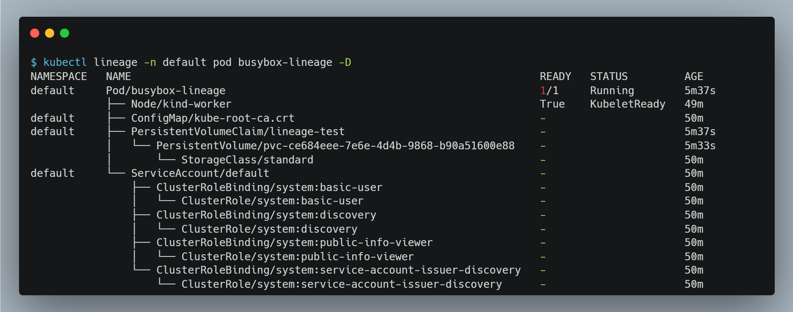
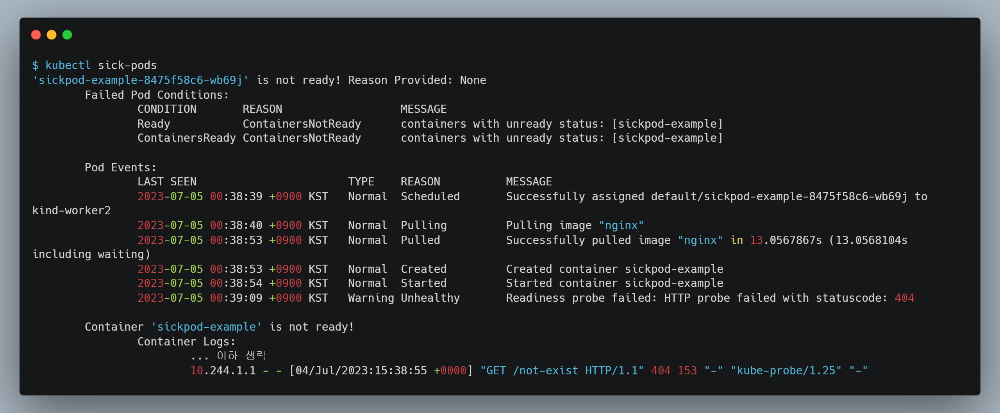

# 개요
* kubectl plugins 정리


# lineage_lineage
* 플러그인 설명: 쿠버네티스 리소스 관계도를 출력
* 플러그인 설치 방법
```bash
kubectl krew install lineage
```

* 플러그인 사용방법
```bash
kubectl lineage -n {namespace} {resource 타입} {resource 이름} -D
```

* 예제

```bash
# manifest 배포
kubectl apply -f ./lineage_example

# 플러그인 사용
kubectl lineage -n default pod busybox-lineage -D

# 삭제
kubectl delete -f ./lineage_example
```




# sick-pods
* 플러그인 설명: not ready상태인 pod를 조회
* 플러그인 설치 방법
```bash
kubectl krew install sick-pods
```

* 플러그인 사용방법
```bash
kubectl sick-pods -n {namespace}
```

* 예제

```bash
# manifest 배포
kubectl apply -f ./sickpods_example

# 플러그인 사용
kubectl sick-pods -n default

# 삭제
kubectl delete -f ./sickpods_example
```

