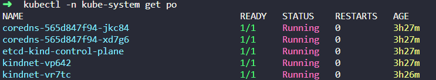
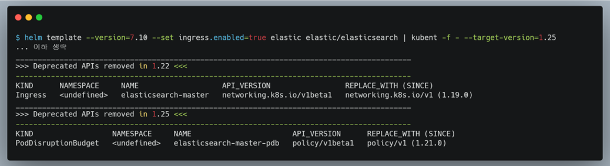
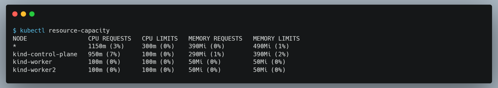
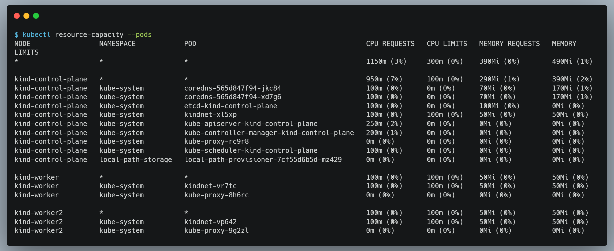
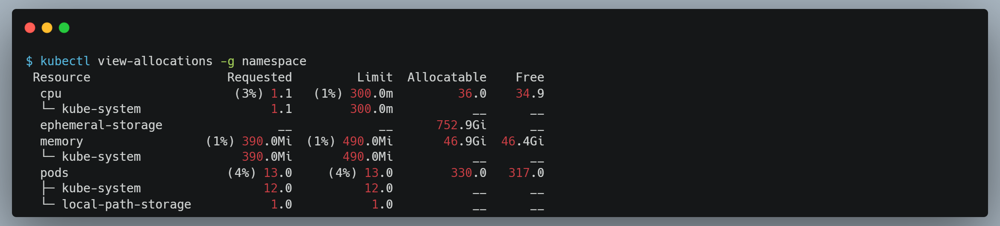
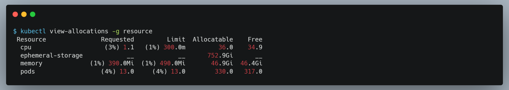

- [개요](#개요)
- [전제조건](#전제조건)
- [kubectl 설정](#kubectl-설정)
  - [kubectl 자동완성](#kubectl-자동완성)
  - [alias k=kubectl](#alias-kkubectl)
  - [kubecolor](#kubecolor)
- [context 관련 도구](#context-관련-도구)
  - [ctx](#ctx)
- [리소스 조회](#리소스-조회)
  - [neat](#neat)
- [쿠버네티스 리소스 배포관련 도구](#쿠버네티스-리소스-배포관련-도구)
  - [kubenet](#kubenet)
- [쿠버네티스 리소스 조회](#쿠버네티스-리소스-조회)
  - [lineage](#lineage)
  - [sick-pods](#sick-pods)
- [로그 조회](#로그-조회)
  - [stern](#stern)
- [자원 모니터링](#자원-모니터링)
  - [resource-capacity](#resource-capacity)
  - [view-allocations](#view-allocations)
- [쿠버네티스 관리 도구](#쿠버네티스-관리-도구)
  - [openlens](#openlens)
  - [k9s](#k9s)
- [참고자료](#참고자료)

# 개요
* 쿠버네티스 CLI 유티릴티 도구 정리

# 전제조건
* 운영체제: 리눅스 또는 MacOS
* krew 설치

# kubectl 설정
## kubectl 자동완성
* 도구 설명: kubectl 인자 자동완성
* 도구 설치 방법
```bash
# bash
echo "source <(kubectl completion bash)" >>~/.bashrc
로그아웃 후 다시 로그인

# zsh
echo "source <(kubectl completion zsh)" >> ~/.zshrc
로그아웃 후 다시 로그인
```

* 도구 사용방법: tab 사용

## alias k=kubectl
* 도구 설명: kubectl 인자 자동완성
* 도구 설치 방법
```bash
# bash
echo "alias k=kubectl" >>~/.bashrc
echo 'complete -o default -F __start_kubectl k' >>~/.bashrc

# zsh
echo "alias k=kubectl" >>~/.zshrc
```

* 도구 사용방법: kubectl 대신 k사용
```bash
k get no
```

## kubecolor
* 도구 설명: kubectl 결과에 색깔을 입혀 가독성을 높힘
* 도구 설치 방법: [github release에서 바이너리](https://github.com/hidetatz/kubecolor/releases) 다운로드 후 alias 설정
```bash
# 다운로드
cd /tmp
wget https://github.com/hidetatz/kubecolor/releases/download/v0.0.25/kubecolor_0.0.25_Linux_x86_64.tar.gz
tar -xvf kubecolor_0.0.25_Linux_x86_64.tar.gz

# 복사
sudo cp ./kubecolor /usr/local/bin
alias kubectl="kubecolor"
```

* alias 영구저장
```bash
# bash alias 영구저장
echo "alias kubectl=kubecolor" >>~/.bashrc
echo "complete -o default -F __start_kubectl kubecolor" >>~/.bashrc

# zsh alias 영구저장
echo "alias kubectl=kubecolor" >>~/.zshrc
echo "compdef kubecolor=kubectl" >>~/.zshrc
```

* 도구 사용방법
```bash
kubectl get po -A
kubectl describe po {pod 이름}
```



# context 관련 도구
## ctx
* 도구 설명: 컨텍스트 스위칭
* 도구 설치 방법
```bash
kubectl krew install ctx
```

* 도구 사용방법
```bash
# 컨텍스트 조회
kubectl ctx

# docker-desktop 컨텍스트 사용
kubectl ctx docker-desktop
```

* 예제
```bash
# kind cluster 2개 생성(docker와 kind가 설치되어있어야 실행됨)
cd ctx_example/
kind create cluster --config cluster-a.yaml
kind create cluster --config cluster-b.yaml

# context 조회
kubectl ctx

# context 전환
kubectl ctx kind-cluster-b

# kind cluster 삭제
kind delete cluster --name cluster-a
kind delete cluster --name cluster-b
```

# 리소스 조회
## neat
* 도구 설명: kubectl get pod {pod이름} -oyaml출력 결과를 읽기좋게 필터링
* 도구 설치 방법
```bash
kubectl krew install neat
```

* 도구 사용방법
```bash
# manifest 배포
kubectl apply -f ./neat_example

# 도구 사용
kubectl -n default get pod busbox-neat -oyaml
kubectl -n default get pod busbox-neat -oyaml | kubectl neat

# 삭제
kubectl delete -f ./neat_example
```

# 쿠버네티스 리소스 배포관련 도구
## kubenet
* 도구 설명: deprecated API 검증
* 도구 설치 방법
```bash
sh -c "$(curl -sSL https://git.io/install-kubent)"
```

* 도구 사용방법
```bash

# elasticsearch helm repo 추가
helm repo add elastic https://helm.elastic.co
helm repo add

# 도구 사용
helm template --version=7.10 --set ingress.enabled=true elastic elastic/elasticsearch | kubent -f - --target-version=1.25
```



# 쿠버네티스 리소스 조회
## lineage
* 도구 설명: 쿠버네티스 리소스 관계도 출력
* 도구 설치 방법
```bash
kubectl krew install lineage
```

* 도구 사용방법
```bash
kubectl lineage -n {namespace} {resource 타입} {resource 이름} -D
```

* 예제

```bash
# manifest 배포
kubectl apply -f ./lineage_example

# 도구 사용
kubectl lineage -n default pod busybox-lineage -D

# 삭제
kubectl delete -f ./lineage_example
```


## sick-pods
* 도구 설명: not ready상태인 pod를 조회
* 도구 설치 방법
```bash
kubectl krew install sick-pods
```

* 도구 사용방법
```bash
kubectl sick-pods -n {namespace}
```

* 예제
```bash
# manifest 배포
kubectl apply -f ./sickpods_example

# 도구 사용
kubectl sick-pods -n default

# 삭제
kubectl delete -f ./sickpods_example
```


# 로그 조회
## stern
* 도구 설명: pod로그 조회
* 도구 설치 방법
```bash
kubectl krew install stern
```

* 도구 사용방법
```bash
kubectl stern pod-query [flags]
```

* 예제
```bash
# 예제 생성
kubectl apply -f stern_example

# default namespace에서 b로 시작하는 pod조회
kubectl stern -n default b

# default namespace 모든 pod 로그 조회
kubectl stern -n default .

# 현재시간 기준으로 10분전, default namespace 모든 pod 로그 조회
kubectl stern -n default . --since 10m

# default namespace 모든 pod 로그에서 first만 조회
kubectl stern -n default . --include "first"

# default namespace 모든 pod 로그에서 404만 조회
kubectl stern -n default . --include "404"

# default namespace 모든 pod 로그에서 first만 제외
kubectl stern -n default . --exclude "first"

# 예제 삭제
kubectl delete -f stern_example
```


# 자원 모니터링
## resource-capacity
* 도구 설명: request, limit 총합 출력
* 도구 설치 방법
```bash
kubectl krew install resource-capacity
```

* 도구 사용방법
```bash
# node별 pod request, limit 총합
kubectl resource-capacity

# 모든 pod requset, limit 조회
kubectl resource-capacity --pods

# 특정 namespace pod request, limit 조회
kubectl view-allocations --pods -n kube-system
```





## view-allocations
* 도구 설명: request, limit 총합 출력
* 도구 설치 방법
```bash
kubectl krew install view-allocations
```

* 도구 사용방법
```bash
# 모든 namespace의 resource 총합
kubectl view-allocations -g resource

# 특정 namespace의 resource 총합
kubectl view-allocations -g resource -n kube-system

# namespace별 resource 총합
kubectl view-allocations -g namespace
```





# 쿠버네티스 관리 도구

## openlens
* GUI기반 도구

## k9s
* CLI기반 관리 도구

# 참고자료
* https://alex-moss.medium.com/down-with-the-krew-my-favourite-kubectl-plugins-279d8d2d5640